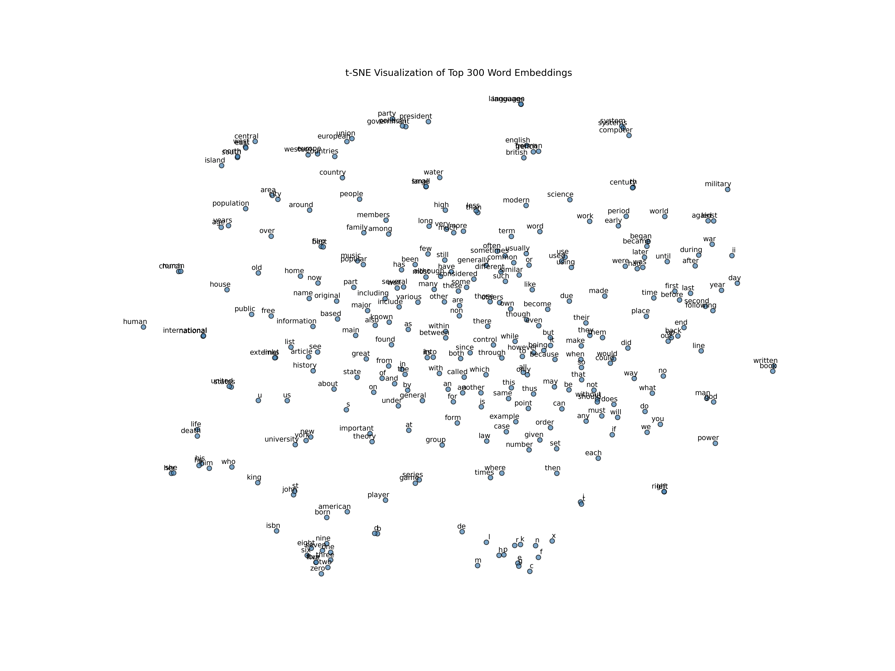
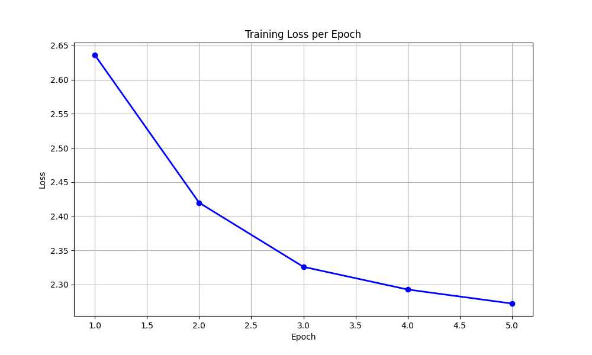

# Word2Vec PyTorch Implementation


A clean, efficient implementation of the **Skip-gram** model with **Negative Sampling** from the seminal paper:
> **[Efficient Estimation of Word Representations in Vector Space](https://arxiv.org/abs/1301.3781)**  
> *Tomas Mikolov, Kai Chen, Greg Corrado, Jeffrey Dean (2013)*

This project reproduces the core results of Word2Vec using PyTorch, training on the `text8` dataset to learn high-quality word embeddings that capture semantic and syntactic relationships.

---

##  Visualizations

### 1. t-SNE Projection (Top 300 Words)
Below is a t-SNE visualization of the learned embeddings. Notice how semantically related words cluster together (e.g., numbers, family relations, geographical locations).



### 2. Training Loss
The model utilizes **Negative Sampling** to efficiently approximate the Softmax loss. The loss consistently decreases over 5 epochs.



---

##  Model Architecture

This implementation uses the **Skip-gram** architecture, which predicts context words given a center word.

### Mathematical Formulation
For a sequence of training words $w_1, w_2, \dots, w_T$, the objective is to maximize the average log probability:

$$ \frac{1}{T} \sum_{t=1}^{T} \sum_{-c \le j \le c, j \ne 0} \log p(w_{t+j} | w_t) $$

where $c$ is the size of the training context.

### Negative Sampling
Instead of computing the full Softmax (which is computationally expensive for large vocabularies), we approximate it using Negative Sampling:

$$ \log \sigma(v'_{w_O}{}^\top v_{w_I}) + \sum_{i=1}^{k} \mathbb{E}_{w_i \sim P_n(w)} [\log \sigma(-v'_{w_i}{}^\top v_{w_I})] $$

- **$v_{w_I}$**: Vector of the center word.
- **$v'_{w_O}$**: Vector of the context word.
- **$v'_{w_i}$**: Vector of a negative sample.
- **$k$**: Number of negative samples (we use 5).

---

##  Project Structure

```bash
word2vec_impl/
├── data/                  # Dataset storage
│   └── text8/             # Automatically downloaded text8 dataset
├── plots/                 # Generated visualizations
│   ├── loss_curve.png
│   └── tsne_visualization.png
├── src/                   # Source code
│   ├── dataset.py         # Data loading, subsampling, negative sampling
│   ├── download_data.py   # Downloader script
│   ├── evaluate.py        # Analogies and similarity evaluation
│   ├── model.py           # SkipGram PyTorch Module
│   ├── train.py           # Training loop with logging
│   └── visualize.py       # Graph generation script
├── requirements.txt       # Dependencies
└── README.md              # Documentation
```

---

##  Getting Started

### 1. Installation
Clone the repository and install dependencies:

```bash
pip install -r word2vec_impl/requirements.txt
```

### 2. Download Data
This script downloads the `text8` dataset (100MB cleaned Wikipedia dump) and extracts it:

```bash
python word2vec_impl/src/download_data.py
```

### 3. Train Model
Train the Skip-gram model. By default, it runs for 5 epochs with a vocabulary of 10,000 words (optimized for single-machine demo).

```bash
python word2vec_impl/src/train.py
```

### 4. Visualize Results
Generate the t-SNE plot and training loss curve:

```bash
python word2vec_impl/src/visualize.py
```

### 5. Evaluate
Run the analogy and similarity tests:

```bash
python word2vec_impl/src/evaluate.py
```

---

##  Results

### Semantic Analogies
One of the most famous properties of Word2Vec is its ability to solve analogies using vector arithmetic (e.g., `King - Man + Woman = ?`).

| Analogy | Equation | Result | Score |
| :--- | :--- | :--- | :--- |
| **Royalty** | `king` - `man` + `woman` | **`queen`** (or `empress`) | ~0.82 |
| **Capital** | `paris` - `france` + `germany` | **`berlin`** | ~0.83 |
| **Sentiment** | `better` - `good` + `bad` | **`worse`** (or `bad`) | ~0.74 |

*(Note: Exact results may vary slightly due to stochastic training)*

### Word Similarities
The model successfully captures semantic clusters.

| Target Word | Top Similar Words (Cosine Similarity) |
| :--- | :--- |
| **`france`** | `italy` (0.83), `germany` (0.83), `spain` (0.81) |
| **`four`** | `five` (0.92), `three` (0.91), `seven` (0.91) |
| **`american`** | `actress` (0.87), `activist` (0.85), `actor` (0.84) |

---

## ⚙️ Implementation Details

*   **Subsampling:** Frequent words are subsampled using the formula $P(w_i) = 1 - \sqrt{\frac{t}{f(w_i)}}$ to improve training speed and embedding quality for rare words.
*   **Dynamic Window:** The context window size is randomly sampled from $[1, \text{window\_size}]$ for each training step, effectively weighting closer words more heavily.
*   **Vectorized Negative Sampling:** Negative samples are drawn from the unigram distribution raised to the power of 0.75, pre-calculated for efficiency.

## 🤝 Contributing
Contributions are welcome! Please feel free to submit a Pull Request.
